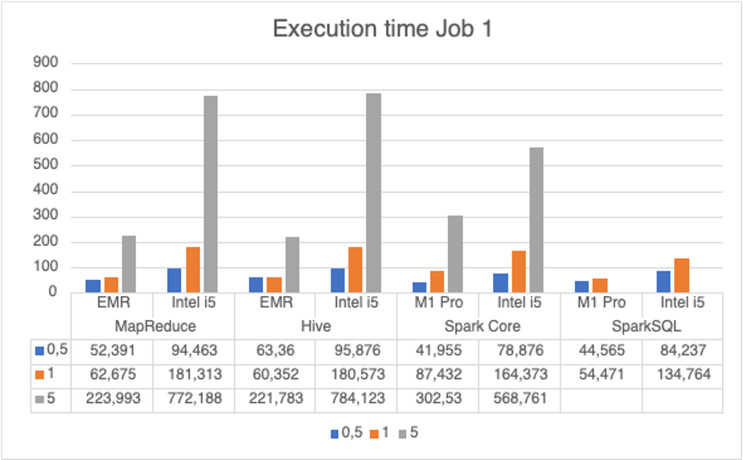
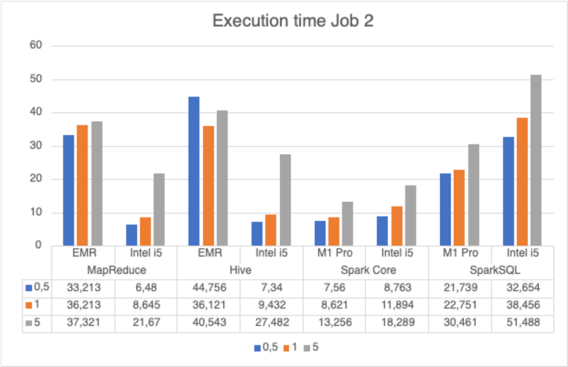

# Big data Project #1 | University of Roma3 - Mr. Torlone

Students:
- Raffaele Scarano - raf.scarano@stud.uniroma3.it
- Gianluca di Lorenzo - gia.dilorenzo1@stud.uniroma3.it

## Amazon Fine Food Reviews Analysis

This repository contains the analysis and manipulation procedures of the "Amazon Fine Food Reviews" dataset extracted from Kaggle. The process leverages four distinct technologies for parallel processing: 

- MapReduce 
- Hive 
- SparkCore 
- SparkSQL 

### Dataset

The dataset contains approximately 500,000 product reviews released on Amazon from 1999 to 2012. The dataset is in CSV format and each row has the following fields:

- Id
- ProductId (unique identifier for the product)
- UserId (unique identifier for the user)
- ProfileName
- HelpfulnessNumerator (number of users who found the review helpful)
- HelpfulnessDenominator (number of users who graded the review)
- Score (rating between 1 and 5)
- Time (timestamp of the review expressed in Unix time)
- Summary (summary of the review)
- Text (text of the review)

### Jobs

Two different jobs have been designed and implemented for each technology:

1. A job capable of generating, for each year, the 10 products that received the highest number of reviews and, for each of them, the 5 words with at least 4 characters most frequently used in the reviews (text field), indicating, for each word, the number of occurrences of the word.

2. A job capable of generating a list of users ordered based on their appreciation, where the appreciation of each user is obtained from the average usefulness (ratio between HelpfulnessNumerator and HelpfulnessDenominator) of the reviews they wrote, indicating for each user their appreciation.

### Execution time

#### Job1

#### Job2

